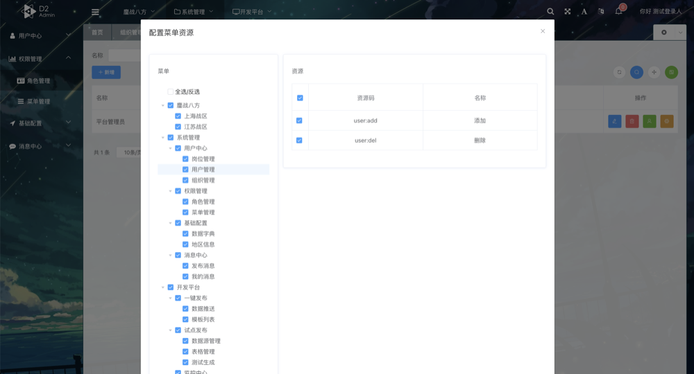
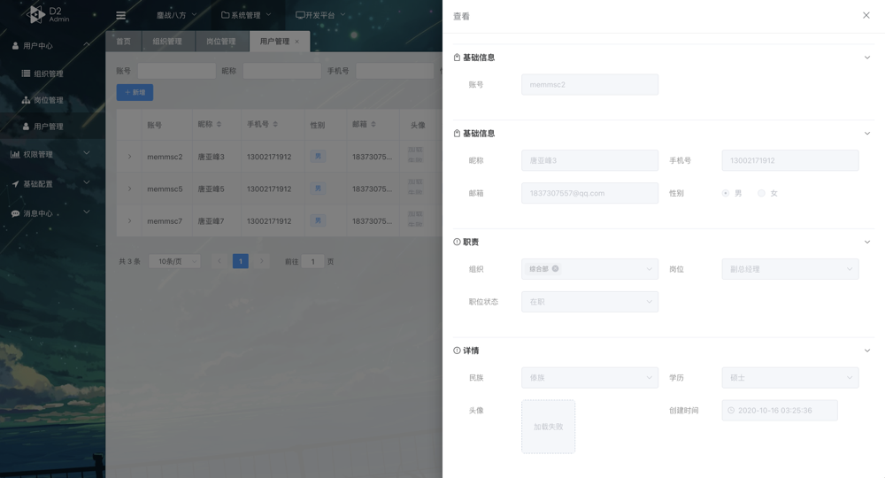

# wemirr-platform

## 演示地址

[演示地址](https://cloud.battcn.com/) 

> 平台账号 0000 账号 admin 密码 123456

> 租户账号 8888 账号 admin 密码 123456


## 软件架构

> 技术交流Q群： 789517089

Vue、Spring Cloud Alibaba 2.2.5.RELEASE、Spring Cloud Hoxton.SR11、Nacos、Sentinel、
Nepxion、Mybatis-Plus、多租户、灰度、Oauth2.0、Spring Security、Redis、Mysql、MongoDB、
ShardingJdbc、ShardingSphere

### 特点

- 布局优雅：简洁、多套主题以及导览模式任意组合搭配
- 功能齐全：SAAS/多租户/RBAC权限控制全都具备，下载代码开箱即用
- 消息推送：内置基于WebSocket、Redis实现的分布式消息
- 服务治理：整合 `Nepxion` 框架可以快速实现蓝绿/灰度/服务治理 等强大功能
- 动态网关：支持页面配置(`Redis`)与 `Nacos` 两种推送方式、动态开启关闭网关路由
- 网关管理：支持流量控制、拉黑名单等
- 大道至简：代码优雅、简短、不管是开发前端还是后端,快就完事了，下面给出一个简单的示例
- 分布式任务：整合 `xxl-job` 提供分布式调度任务功能
> Vue 开发只需要几行简短的代码即可完成单表的CRUD，大大提升开发效率

``` vue
<template>
  <fs-crud ref="crudRef" v-bind="crudBinding"/>
</template>
```


## 效果图







## 介绍

开源里面UI最好、最容易上手的、中台 、SAAS 、 多租户功能、最最少的代码实现功能

[文档地址](https://www.yuque.com/books/share/c5467c7b-ae67-4d3e-a6cd-541ce5a90bb7?#《wemirr-platform-doc》) 

[配套前端](https://gitee.com/battcn/wemirr-platform-ui) 配套的 UI 

[Nepxion-Discovery](https://github.com/Nepxion/Discovery) 蓝绿、灰度、流量保护

[OpenAPi3](https://springdoc.org/) Swagger 标准版

### 拓展阅读

[Oauth2.0](https://www.ruanyifeng.com/blog/2019/04/github-oauth.html) OAuth2.0 知识点


`wemirr-platform-bury` 是一个用 `shardingsphere` 做分表分库收集日志的，常见埋点日志手段
- **`记录日志文件,EFK/ELK采集日志`**
- **`日志量小的话可以写到库`**
- **`日志量大可以分表分库记录埋点日志，定期清理`**

### 注意事项

**如果需要使用低码平台，需要安装 MongoDB 的支持**

**nepxion 项目是本人用于测试一些中间件的工程、完全可以忽略**

### 环境安装

一般安装 `latest` 版本即可，也可以自行指定版本 `docker search` 或者自己上 `docker hub` 看版本

**如果需要体验低码平台一键发布需要安装 `MongoDB` 除此之外其它中间件是必须的**


``` shell script
docker pull redis:latest
docker run -itd --name redis -p 6379:6379 redis

安装 Mysql 
docker pull mysql:latest
docker run -itd --name mysql-test -p 3306:3306 -e MYSQL_ROOT_PASSWORD=123456 mysql


安装 Sentinel-Dashboard
docker pull bladex/sentinel-dashboard
docker run -i -t -d -p 8858:8858 -p 8719:8719  bladex/sentinel-dashboard

安装 Nacos
docker pull nacos/nacos-server
docker  run --name nacos -d-p 8848:8848 --restart=always -e MODE=standalone

安装 RabbitMQ
docker pull docker.io/macintoshplus/rabbitmq-management
docker run -d  -p 5671:5671 -p 5672:5672  -p 15672:15672 -p 15671:15671  -p 25672:25672  rabbitmq_image_id

安装 XXL-JOB-ADMIN(暂时不行没找到好方法,自己fork代码执行) 配置外网IP应该可以
docker pull xuxueli/xxl-job-admin:2.3.0
docker run -e PARAMS="--spring.datasource.username=root --spring.datasource.password=123456 --spring.datasource.driver-class-name=com.mysql.cj.jdbc.Driver --spring.datasource.url=jdbc:mysql://127.0.0.1:3306/wemirr-platform?useUnicode=true&characterEncoding=UTF-8&autoReconnect=true" -p 9999:8080 -v /Users/battcn/Development:/data/applogs --name xxl-job-admin  -d xuxueli/xxl-job-admin:2.3.0
```


### 关于埋点日志

``` java
@Bean
public SysLogListener sysLogListener(OptLogService optLogService) {
    return new SysLogListener(optLogService::save);
}

// 如果操作量大又想记录到数据库，请用该组件
@Bean
@ConditionalOnExpression
public SysLogListener sysLogListener(BuryPointClient buryPointClient) {
    return new SysLogListener(buryPointClient::buryPoint);
}
```

